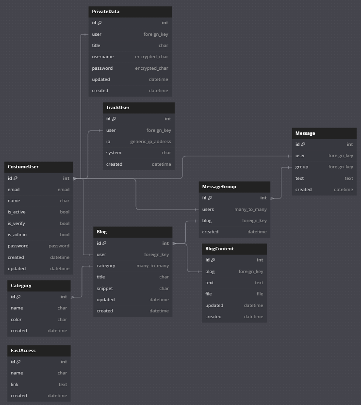

<h1>BLOG + CHAT + PRIVATE_DATA</h1>
<h3>⚡ DJANGO + REST_API + HTMX + WEBSOCKET + DOCKER + CELERY + REDIS ⚡</h3>
<h5>🌀  this is a django project that contain most of the django challenges 🌀 </h5>

# ☢️PRIVACY (accounts)☢️

<h5>🎴 contain registration, login, logout, change-password, forget-password using Session, Token, JWT</h5>
✅links -> <a href="https://docs.djangoproject.com/en/5.1/topics/auth/default/">Session</a> | <a href="https://www.django-rest-framework.org/api-guide/authentication/">Token</a> | <a href="https://jwt.io/">JWT</a>
<h5>🔥 signup</h5>
<ul>
    <li>prevent authenticated users to open signup page</li>
    <li>password, confirm-password
        <p>1- both should be available</p>
        <p>2- should be same</p>
        <p>3- length > 8 char</p>
        <p>4- at least 1 alpha char</p>
        <p>5- at least 1 uppercase char</p>
        <p>6- at least 1 number</p>
        <p>7- at least one slower char</p>
    </li>
    <li>email nad name are unique so it's impossible to set registered email or name</li>
</ul>

<h5>🔥 login</h5>
<ul>
    <li>Session
        <ul>
            <li>use authenticate to check username and password and also get user, if everything is ok then user will set on session and logged in</li>
        </ul>
    </li>
    <li>Token
        <ul>
            <li>check verification</li>
            <li>use authenticate to check username and password</li>
            <li>if token didn't generated before then new token will create in database and can be accessed with user_id</li>
            <li>return token.key, user_id, email as response</li>
        </ul>
    </li>
    <li>JWT
        <ul>
            <li>check match of username and password</li>
            <li>refresh token is a separate token that is used to obtain a new access token after the old one expires. It is usually long-lived (e.g., valid for days, weeks, or even months)</li>
            <li>access token is the main JWT used to authenticate requests. It contains user information and permissions and is usually short-lived (e.g., expires in 15 minutes to a few hours)</li>
        </ul>
    </li>
</ul>

<h5>🔥 logout</h5>
<ul>
    <li>Session
        <ul>
            <li>delete session so user will log out</li>
        </ul>
    </li>
    <li>Token
        <ul>
            <li>delete token from database</li>
        </ul>
    </li>
</ul>

<h5>🔥 activate user ( with JWT )</h5>
<ul>
    <li>generate and send token
        <ul>
            <li>evaluate for
                <p>1- user should be existed with added email</p>
                <p>2- user shouldn't verified before</p>
            </li>
            <li>create refresh token for user and send access token with email</li>
        </ul>
    </li>
    <li>activate user
        <ul>
            <li>when user click on link it will start activation</li>
            <li>evaluate
                <p>1- check validation of token</p>
                <p>2- check expiration of token</p>
                <p>3- check correction of token</p>
                <p>4- user shouldn't verified before</p>
            </li>
        </ul>
    </li>
</ul>
<p>🌀 in webpage email will automatically send with user who authenticated ( there is not field )</p>

<h5>🔥 forget password ( with JWT and auto-activation for user )</h5>
<p>🌀 it similar with change-password but we should get user with token, look line activation user ( with JWT )</p>
<ul>
    <li>generate and send token
        <ul>
            <li>evaluate for
                <p>1- user should be existed with added email</p>
            </li>
            <li>create refresh token for user and send access token with email</li>
        </ul>
    </li>
    <li>confirm and change-password
        <ul>
            <li>when user click on link it will confirm that you are the one who forget password ( cause you have access to read email )</li>
            <li>evaluate
                <p>1- check validation of token</p>
                <p>2- check expiration of token</p>
                <p>3- check correction of token</p>
                <p>4- check password-strength with methods that used in signup</p>
            </li>
            <li>check user verification and change it to verified-user ( if still not verified )</li>
            <li>in the end set new password for user</li>
        </ul>
    </li>
</ul>

<h5>🔥 track users</h5>
<p>🌀 used for count users per each day and also show users logged in devices ( for more privacy )<br>
🌀 track-users added to middleware so this method will check in each request<br>
🌀 each user or system will be saved if there is no similar object in database with below items</p>
<ul>
    <li>USER: if there is non-authenticated-user it will set with Blank</li>
    <li>IP: using "HTTP_X_FORWARDED_FOR" or "REMOTE_ADDR"</li>
    <li>SYSTEM: using "HTTP_USER_AGENT"</li>
</ul>

# ☣️APP - PRIVATE_DATA☣️
<p>🎴 this app is just contain username and password field that save data in DB but the point is that both of username and password will be saved after encrypted by 🔐CRYPTOGRAPHY🔐<br>
🔴 it could be so usefull for SECURITY and DATABASE-ATTACK<br>
🔵 this app will also check authentication and activation of users
</p>
✅ Source -> <a href="https://cryptography.io/en/latest/fernet/">cryptography</a>
<h5>⚙️ how to use 🔐cryptography🔐:</h5>

<p>
1- pip install cryptography<br>
2- generate new key

```python
from cryptography.fernet import Fernet
print(Fernet.generate_key())
```
3- add it to core/settings.py

```python
# cryptography-key
CRYPTOGRAPHY_KEY = b'your-generated-key'
```
4- create cryptography.py and create customized encrypt and decrypt 
```python
from cryptography.fernet import Fernet
from django.conf import settings

fernet = Fernet(settings.CRYPTOGRAPHY_KEY)

def encrypt(text):  # str[text] -> byte[text] -> encode -> byte[token] -> str[token]
    byten_text = text.encode(encoding="utf-8")
    byten_encrypt = fernet.encrypt(byten_text)
    str_token = byten_encrypt.decode(encoding="utf-8")
    return str_token

def decrypt(token):  # str[token] -> byte[token] -> decode -> byte[text] -> str[text]
    byten_token = token.encode(encoding="utf-8")
    byten_decrypt = fernet.decrypt(byten_token)
    str_text = byten_decrypt.decode(encoding="utf-8")
    return str_text
```
5- now use 🔶encrypt-method🔶 everytime you want to create private-data in DB and use 🔶decrypt-method🔶 everytime you want to read private-data in DB
</p>

# APP - BLOG
🎴 this app used for create blog with text, file, image. also each blog orgnized as unique-title, summary and multiple-category<br>
🔴 permissions: everyone can read blog-details but authenticated and activated users can create their own blog, also only author can add content to it's blog
<h5>📤how to upload-file in django📤</h5>
💥 checkout my repository 💥 ➡ <a href="https://github.com/999-amir/upload-file-in-Django">how to upload-file in Django</a>

# APP - MESSAGE
🎴 this app used for create chat-group for each blog and users can join the group by open messages in each blog<br>
🔴 permissions: only authenticated and activated and joined-members ( if some non-joined-user open the page it will automatically add to group )<br>
💥 at the next generation this app will be realtime chat app with display of online users 💥<br>
<ul>
    <li>when ever time that a blog created then a message-group will automatically create by signals and also add author to group as blog-author</li>
    <li>each message-group will be recognized as blog(foreign-key) and users(many-to-many)</li>
    <li>and also each message will be recognized with message-group, user, text</li>
    <li>in this case we can split messages by self ( request->user ), author ( message -> message-group -> blog -> user ), others ( message -> user )</li>
</ul>

# 🗂️ database diagram


# 🌀 HTMX & HYPERSCRIPT 🌀
<p>🎴 used for convert [blog, message, private_data] tasks into asynchronous tasks<br>
it also make views much faster because there is no need for full-render. with HTMX we can update our selected part in page<br>
🌀 checkout network requests in ◆ website -> home-page -> inspect -> network ◆</p>

💥 checkout my repository 💥 ➡ <a href="https://github.com/999-amir/django-messager">how to use HTMX in Django</a>

# 🤖 WEBSOCKET 🤖
🎴 used for make realtime chat application that can show new messages without refreshing the page and also show online-users

🔥 what is websocket:<br>The WebSocket API is an advanced technology that makes it possible to open a two-way interactive communication session between the user's browser and a server. With this API, you can send messages to a server and receive event-driven responses without having to poll the server for a reply

✅ Source -> <a href="https://channels.readthedocs.io/en/latest/">django-channels</a><br>
💥 checkout my repository 💥 ➡ <a href="https://github.com/999-amir/django-messager">simple example of django-message-app</a>

🌀 steps of create websocket:<br>
1- install 🐍channels-package<br>
2- add it to ️⚙️INSTALLED_APPS( daphne )<br>
3- change from ️⚙️"WSGI_APPLICATION"into ️⚙️"ASGI_APPLICATION"<br>
4- add websocket to 📁core/asgi.py and link it with 📁app/routing.py<br>
5- create 📁app/routing.py and link it with 📁app/consumer.py<br>
6- create 📁app/consumer.py with inherit class of 🐍WebsocketConsumer with<br>[ 🟩connect, 🟪receive, 🟥disconnect ] methods ( each method should be connected with the same channel to make users connected and show changes on page to eachother )<br><br>
7- 🟩connect-method used for evaluate 🔒user-access ( permissions ) for accept 🤝hand-shake and make group, user to initialize with others-methods and also save user in database as online_user<br>
8- 🟥disconnect-method is called when user get out of the page, it also used to remove user from online_users in database<br>
9- 🟪receive-method used for edit or change database-models such as save new messages text and send saved-element-id into 🕹️function-handler-method<br>
10-🕹️in function-handler-method we make visualization for all users that in the same channel by the way of create context and send it to template. at the next template will be send to current-page so we should use template with hx-swap-oob in HTMX
